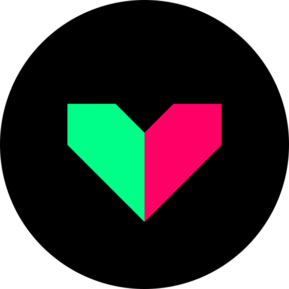
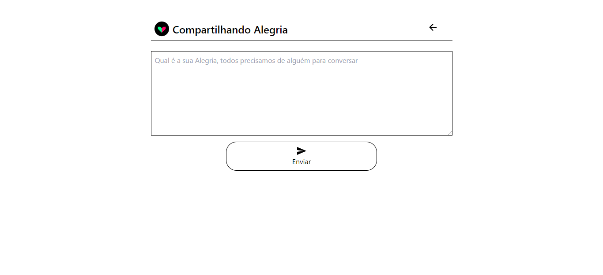
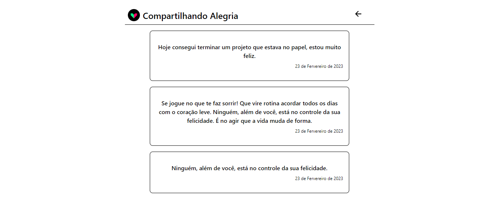

<h1 align="center">
  
</h1>

  <a href="#-tecnologias">Tecnologias</a>&nbsp;&nbsp;&nbsp;|&nbsp;&nbsp;&nbsp;
  <a href="#-projeto">Projeto</a>&nbsp;&nbsp;&nbsp;|&nbsp;&nbsp;&nbsp;
  <a href="#-layout">Layout</a>&nbsp;&nbsp;&nbsp;|&nbsp;&nbsp;&nbsp;
  <a href="#memo-licença">Licença</a>

 

  

 

  

  

## 🚀 Tecnologias

Esse projeto foi desenvolvido com as seguintes tecnologias:

# Front-end

- Next Js
- Tailwind
- React Query
- React Hook Forms

# Back-end

- Python
- Django Rest Framework

## 💻 Projeto

O site "Compartilhando Alegria" é uma plataforma online que tem como objetivo incentivar a propagação de boas energias e motivação. Nele, é possível cadastrar e compartilhar frases positivas que podem alegrar o dia de alguém, além de também ser uma ferramenta para registrar e comemorar nossas próprias conquistas pessoais. Com uma interface simples e intuitiva, o site é um convite para que possamos disseminar a alegria e o otimismo em nosso dia a dia.👐

## 🔖 Layout

Você pode visualizar o projeto através [desse link](https://compartilhando-alegria.vercel.app/).

## :memo: Licença

Esse projeto está sob a licença MIT. Veja o arquivo [LICENSE](LICENSE.md) para mais detalhes.
